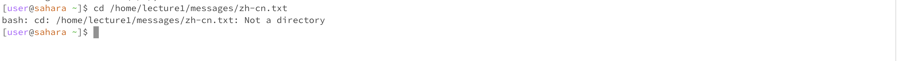

# **Lab 1 Report**
---
## **1. Using the command 'cd' with no arguments**

* The working directory was '/home' when the command 'cd' was run.
* Using 'cd' without any arguments led to the home directory, a convenient way to return to the original directory within the file system.
* The output is not an error.
## **2. Using the command 'cd' with a path to a directory as an argument**

* The working directory was '/home' when the command 'cd' was run.
* By inputting "/home/lecture1/messages" as the command line argument with the utilization of the command 'cd', it successfully changed my working directory to the indicated
    one by the filesystem and the specific path.
* The output is not an error.
## **3. Using the command 'cd' with a path to a file as an argument**

* The working directory was '/home' when the command 'cd' was run.
* I got the error output since the 'cd' command is designed to work as changing the current directory to another directory as a destination, instead of a file.
* The output is an error, since the 'cd' command works by changing to a path of a directory other than of a file.
## **4. Using the command 'ls' with no arguments**

* The working directory was '~/lecture1/messages' when the command 'ls' was run.
* The output shows the list of files and folders of the '~/lecture1/messages' directory since this is exactly what the command 'ls' does by default.
* The output is not an error.
## **5. Using the command 'ls' with a path to a directory as an argument**

* The working directory was '~/lecture1/messages' when the command 'ls' was run.
* The output shows the list of files and folders of the '/home/lecture1/messages' directory since this is the default function of the command 'ls'.
* The output is not an error.
## **6. Using the command 'ls' with a path to a file as an argument**

* The working directory was '~/lecture1/messages' when the command 'ls' was run.
* I got the output showing the same as my input argument since there are no sub-files or folders in the given path that can be listed.
* The output is an error, since since the command 'ls' is to show the list of files and folders under that directory, instead of an indicated file.
## **7. Using the command 'cat' with no arguments**

* The working directory was '/home' when the command 'cat' was run.
* It waits for my input when I use 'cat' with no argument since the command 'cat' needs a valid argument to do its job; otherwise, the system will not stop until entering 'ctrl+c'.
* The output is an error. The command 'cat' needs to be followed by paths to do its work.
## **8. Using the command 'cat' with a path to a directory as an argument**

* The working directory was '/home' when the command 'cat' was run.
* I got this outputting error message since the path leads to a directory, not a file.
* The output is an error. The command 'cat' is used to display the context of the text files instead of a directory.
## **9. Using the command 'cat' with a path to a file as an argument**

* The working directory was '/home' when the command 'cat' was run.
* When the command 'cat' was run with a path of files as an argument, the output displays the content of the file, which reflects the successfulness of the operation.
* The output is not an error.
  
