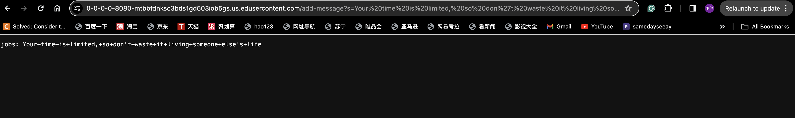
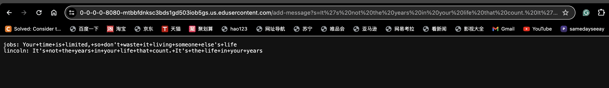
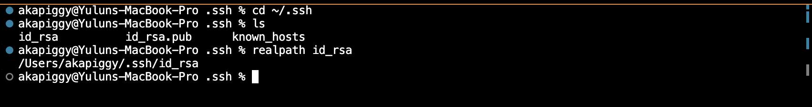
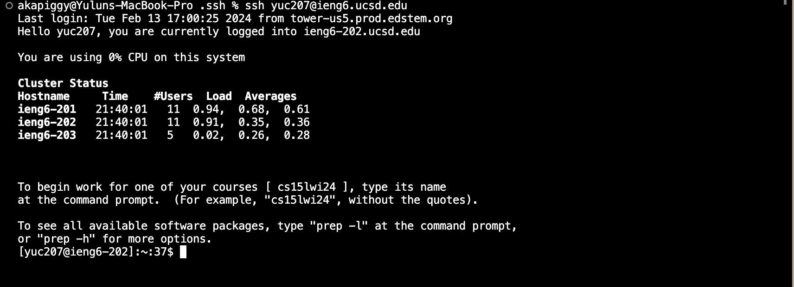

# **Lab 2 Report**
---
* ## **Part 1**
  * Code for my ChatServer:

  ```
  import java.io.IOException;
  import java.net.URI;

  class StringHandler implements URLHandler {
    
      String words = "";

      public String handleRequest(URI url) {
          if (url.getPath().equals("/")) {
              return words;
          } 
          else if (url.getPath().equals("/add-message")) {
              String[] parameters = url.getQuery().split("&");
              String[] wordParameters = parameters[0].split("=");
              String[] userParameters = parameters[1].split("=");
              if(wordParameters[0].equals("s") && userParameters[0].equals("user")){
                  words += userParameters[1] + ": " + wordParameters[1] + "\n";
                  return words;
              }
          } 
          return "404 Not Found!";
        
    }
  }

  class ChatServer {
      public static void main(String[] args) throws IOException {
          if(args.length == 0){
              System.out.println("Missing port number! Try any number between 1024 to 49151");
              return;
          }

          int port = Integer.parseInt(args[0]);

          Server.start(port, new StringHandler());
      }
  }
  ```
    * First screenshot using `/add-message`:
    
      1.   Which methods in your code are called?
           The `main` method in the `class ChatServer` is first called when the Java program runs. It checks if the valid port number is inputted from the command line argument. If so, it will start the server
           and pass an object of StringHandler as an argument into the `Server.start` method. Then, the method `handleRequest` is called to handle the request of the URL, implements its functions and print a string
           to the web screen.
           
      2.   What are the relevant arguments to those methods, and the values of any relevant fields of the class?
           The relevant argument to
             * the `main` method: args. This is the array of command-line arguments passed to the main method.
             * the `Server.start` method: port, and an object of type StringHandler.
             * the `handleRequest` method: url. This is the URI representing the incoming request.
           The values of any relevant fields of the class:
             * `class ChatServer`: the value of `port` is 0 by default.
             * `class StringHandler`:
                 the value of `parameters` is {}
                 the value of `wordParameters` is {}
                 the value of `userParameters` is {}
                 the value of `words` is ""
      3.   How do the values of any relevant fields of the class change from this specific request? If no values got changed, explain why.
             * `class ChatServer`: the value of `port` changes to 8080.
             * `class StringHandler`:  
                 the value of `parameters` changes to {"s=Your time is limited, so don't waste it living someone else's life", "user=jobs"}  
                 the value of `wordParameters` changes to {"s", "Your time is limited, so don't waste it living someone else's life"}  
                 the value of `userParameters` changes to {"user", "jobs"}  
                 the value of `words` changes to "jobs: Your time is limited, so don't waste it living someone else's life/n"  
    * Second screenshot using `/add-message`;
    
      1.   Which methods in your code are called?
           The `main` method in the `class ChatServer` is first called when the Java program runs. It checks if the valid port number is inputted from the command line argument. If so, it will start the server
           and pass an object of StringHandler as an argument into the `Server.start` method. Then, the method `handleRequest` is called to handle the request of the URL, implements its functions and print a string
           to the web screen.
           
      2.   What are the relevant arguments to those methods, and the values of any relevant fields of the class?
           The relevant argument to
             * the `main` method: args. This is the array of command-line arguments passed to the main method.
             * the `Server.start` method: port, and an object of type StringHandler.
             * the `handleRequest` method: url. This is the URI representing the incoming request.
           The values of any relevant fields of the class:
             * `class ChatServer`: the value of `port` is 8080.
             * `class StringHandler`:
                 the value of `parameters` is {"s=Your time is limited, so don't waste it living someone else's life", "user=jobs"}
                 the value of `wordParameters` is {"s", "Your time is limited, so don't waste it living someone else's life"}
                 the value of `userParameters` is {"user", "jobs"}
                 the value of `words` is "jobs: Your time is limited, so don't waste it living someone else's life\n"
      3.   How do the values of any relevant fields of the class change from this specific request? If no values got changed, explain why.
             * `class ChatServer`: the value of `port` does not change, since the main method is called once, and upon the server started, the value of port number remains the same as long as the server is running.
             * `class StringHandler`:  
                 the value of `parameters` changes to {"s=It's not the years in your life that count. It's the life in your years", "user=lincoln"}  
                 the value of `wordParameters` changes to {"s", "It's not the years in your life that count. It's the life in your years"}  
                 the value of `userParameters` changes to {"user", "lincoln"}  
                 the value of `words` changes to "jobs: Your time is limited, so don't waste it living someone else's life\nlincoln: It's not the years in your life that count. It's the life in your years\n"
  
---
* ## **Part 2**
  * Screenshot for the absolute path to the private key for your `SSH` key for logging into `ieng6` on my computer:
  
    
  * The absolute path to the public key for your `SSH` key for logging into `ieng6` on `ieng6` filesystem:
  
    
  * A terminal interaction where you log into your ieng6 account without being asked for a password:
  
    
---
* ## **Part 3**
  * In a couple of sentences, describe something you learned from the lab in week 2 or 3 that you didn't know before.  
     - I've learned a lot from the lab in week 2 and 3. Right now, I've learned how to set up my own web server by writing some handler classes along with the server.java provided. I also learned how to access a remote machine
    by using scp and how to load and transfer files from local to remote by using curl and scp. I've learned how to set up my public and private keys for logging on remote devices without having to type my password each time.
    
