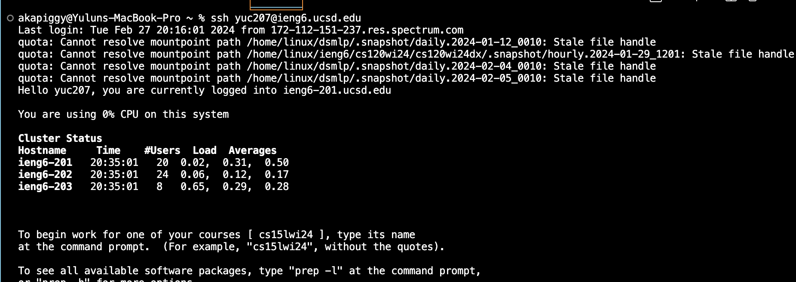
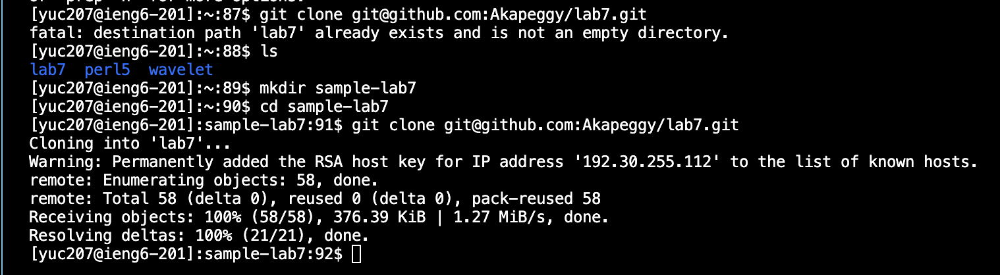
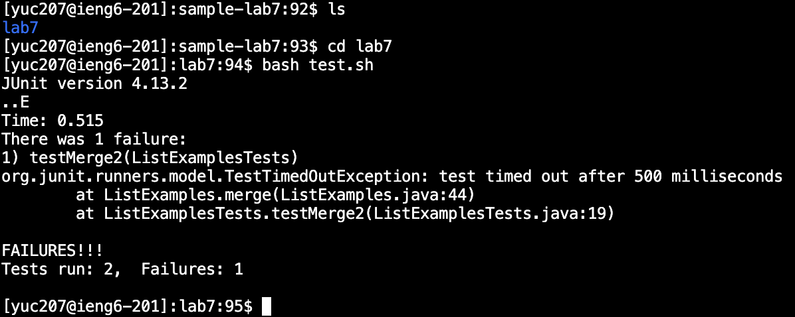
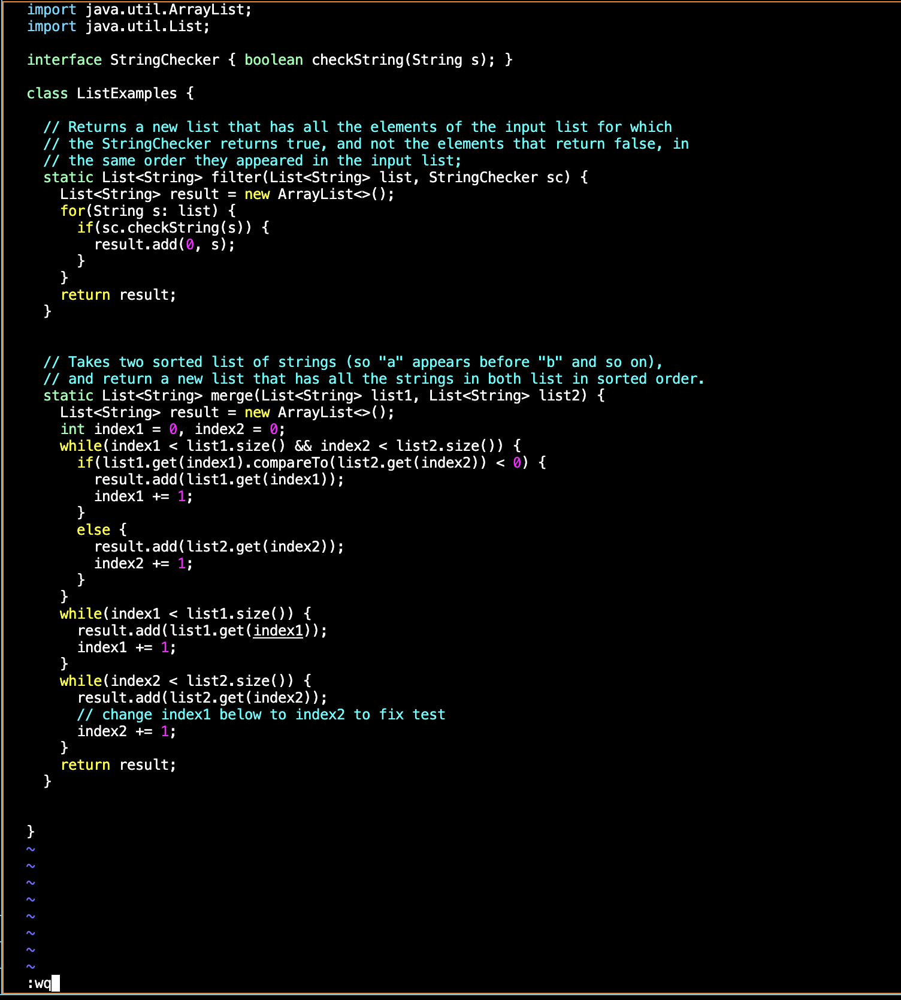
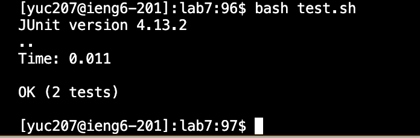
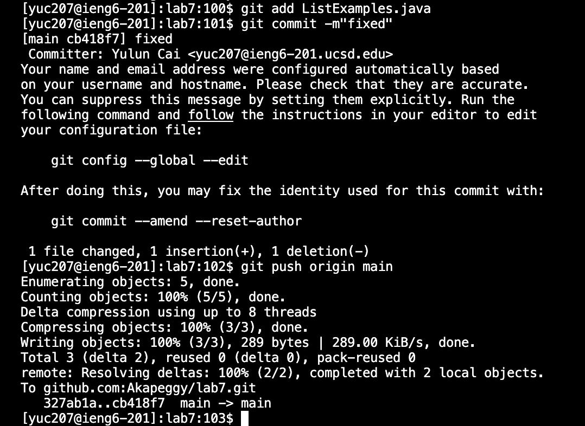

# **Lab 4 Report**
---
  * **Step 4: Log into ieng6**
    
    * Keys pressed: `ssh<space>yuc207@ieng6.ucsd.edu<enter>`
      I typed `ssh yuc207@ieng6.ucsd.edu` on my local computer's command line to access the ieng6 remote machine, and the image shows it's succeeded.
---
  * **Step 5: Clone your fork of the repository from your GitHub account (using the SSH URL)**
    
    * keys pressed: `git<space>clone<space><command><v><enter>`, `ls<enter>`, `mkdir<space>sample-lab7<enter>`, `cd<space>sample-lab7<enter>`, `<up><up><up><up><enter>`,
      I tried to clone the repository by typing `git clone git@github.com:Akapeggy/lab7.git`, but it seems to have failed since an unempty file called "lab7" already exists in the current directory. Thus, I typed `ls` to 
      show the files under the current directory, and typed `mkdir sample-lab7` to make a new directory called `sample-lab7`, and then 4 times `up` and then `enter` since the clone command is 4 up away.
      Finally, it shows my cloning success.
---
  * **Step 6: Run the tests, demonstrating that they fail**
    
    * Keys pressed: `ls<enter>`, `cd<space>lab7<enter>`, `bash<space>test.sh<enter>`
      I typed `ls` to double check that "lab7" has been cloned in the directory `sample-lab7/`. Then I typed `cd lab7` to change my directory into the directory `lab7/`, and then I typed `bash test.sh` to run the shell script which
      has the compile commands inside. It shows that it runs 2 tests, and the test in the method called `testMerge2` of the file `ListExamplesTests.java` failed at line 19.
---
  * **Step 7: Edit the code file to fix the failing test**
    
    
    * Keys pressed: `vim<space><command><v><enter>`, `43j`,`11l`,`r2`,`<shift+;>wq<enter>`
      I typed `vim<space><command><v><enter>` to edit the file `ListExamples.java`, and respectively typed `43j`, which let the cursor go below 43 lines, `11l`, which let the cursor to move 11 places to the right,
      `r2`, which changes the character at the current cursor place to be 2, and `:wq` to save the changes and quit Vim.
---
  * **Step 8: Run the tests, demonstrating that they now succeed**
    
    * Keys pressed: <up><up><enter>
      I typed 2 times `up` and `enter` since the command `bash test.sh` is 2 up away. It shows that rerun the test successfully, all tests passed.
---
  * **Step 9: Commit and push the resulting change to your GitHub account**
    
    * Keys pressed: `git<space>add<space><command><v>`, `git<space>commit<space><->m<">fixed<">`, `git<space>push<space>origin<space>main`
      I typed `git add ListExamples.java` to update the file `ListExamples.java` to be committed, where I copied the name of the file and pasted it. Then I typed `git commit -m"fixed"` to commit my changes such that it will show
      in my GitHub commit history as well with my description "fixed" for this commit. Finally, I typed `git push origin main` to push the commit to my GitHub main such that the file `ListExamples.java` in my own repository has been updated.
    
