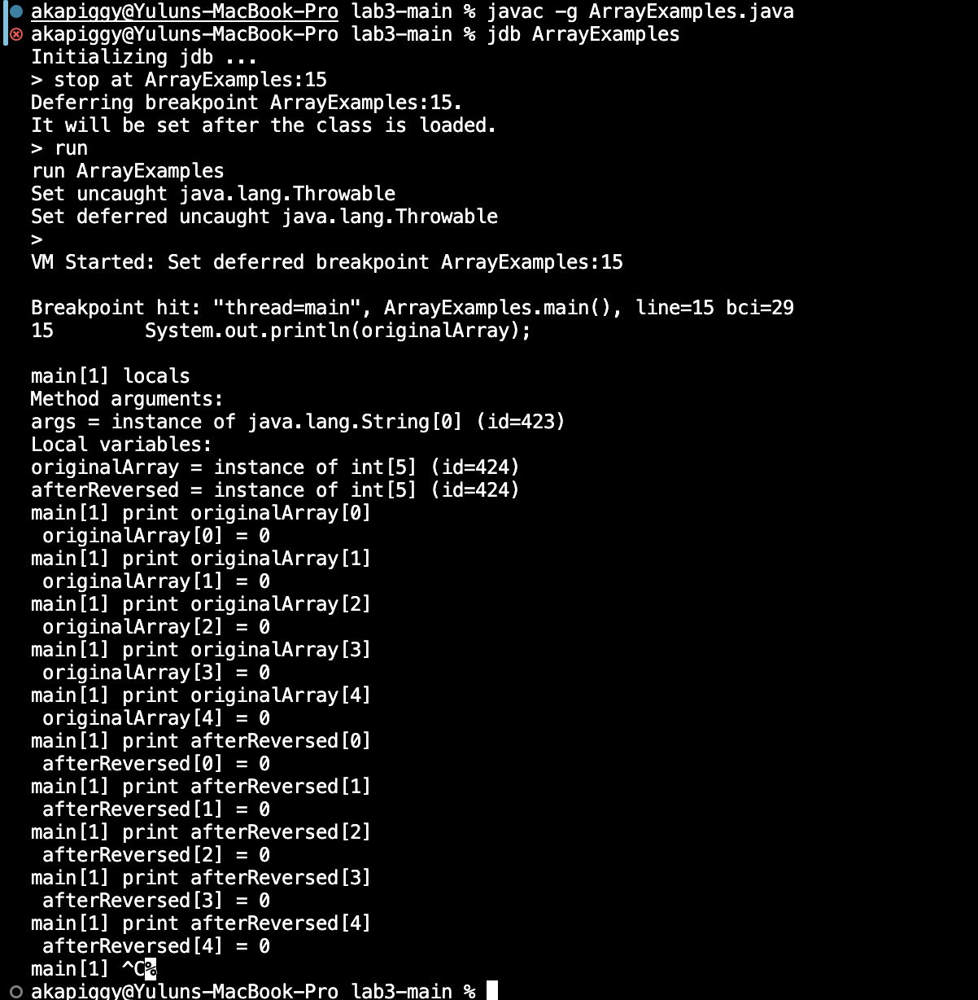
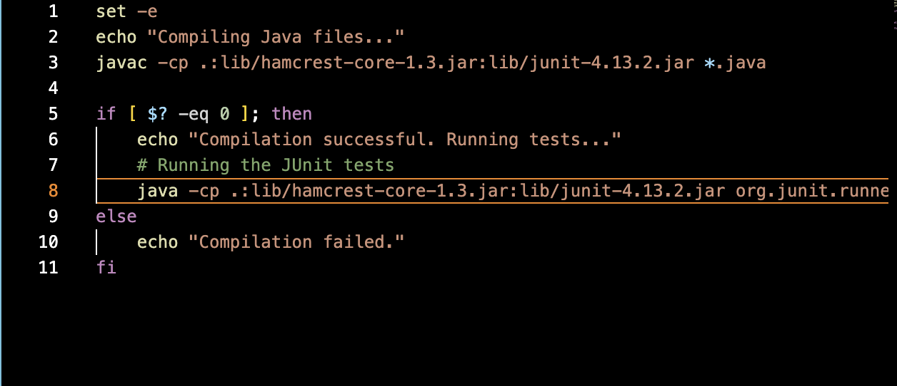

# **Lab 5 Report**
* ## **Part 1**
  1. The original post from a student with a screenshot showing a symptom and a description of a guess at the bug/some sense of what the failure-inducing input is.
     ```
     Title: Getting trouble with method 'reversed' in ArrayExample.java

     Hi,
     I faced an issue that my test failed on the method 'reversed' in  JavaExample.java. I tried to run tests on this method to reverse my array '{1,2,3,4,5}'. However, the test failed. and the method doesn't seem to
     run properly. The symptom shows the expected array element does not match the correct order. I guess it may be due to the wrong implementation of the for loop. I'm attaching the screenshot of the 'reversed' method
     , my test file, and the symptom as following. I need some advice to figure out what causes the error here. Thank you!
     ```
     ArrayExamples.java :
     

     ArrayTests.java :
     

     Symptom:
     
     
  2. A response from a TA asking a leading question or suggesting a command to try.
     ```
     Hi,

     It seems like there could be an issue with your loop logic in reversed(int[] arr).
     Can you add debug prints inside the loop to show the value of arr[i] and
     arr[arr.length - i - 1] before and after the swap at each iteration? This should help us
     see what's happening during each step of the reversal process.
  3. Another screenshot/terminal output showing what information the student got from trying that, and a clear description of what the bug is.
     
  4. At the end, all the information needed about the setup including:
     * The file & directory structure needed
       * My buggy program:
         
       * My test file:
         
       * my script file:
         
       * directory:
         -lab3
           -lib/
             -hamcrest-core-1.3.jar
             -junit-4.13.2.jar
           -ArrayExamples.java
           -ArrayTests.java
           -test.sh
     * The contents of each file before fixing the bug
       
     * The full command line (or lines) you ran to trigger the bug
       
     * A description of what to edit to fix the bug
       Instead of coding 'arr[i] = newArray[arr.length - i - 1];' in line 8, code 'newArray[i] = arr[arr.length - i - 1]'
 
* ## **Part 2**
  * Vim command
    I’ve learned the Vim keybindings and commands for my code editor.Vim enables rapid editing tasks without relying on a mouse, 
    which streamlines my workflow.Additionally, its suitability for remote or SSH environments, where graphical editors mightnot be practical,
    is a significant advantage.Furthermore, mastering Vim has deepened my understanding of text editing and command-line interfaces,
    and this skills are crucial in many IT and development roles.
